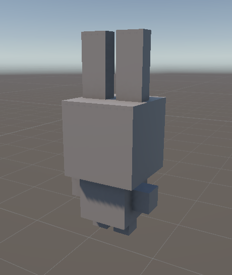

# 第1次練習題目-隨堂-QZ1
>
>學號：113111130 (換成自己的)
><br />
>姓名：王小明 (換成自己的)
><br />
>作業撰寫時間：90 (mins，包含程式撰寫時間，換成自己的)
><br />
>最後撰寫文件日期：2026/10/05 (換成自己的)
>

本份文件包含以下主題：(至少需下面兩項，若是有多者可以自行新增)
- [x] 說明內容
- [x] 其他 (可以包含心得或是想跟老師反映)

## 說明內容

開始寫說明，該說明需說明想法，
並於之後再對上述想法的每一部分將程式進一步進行展現，
若需引用程式區則使用下面方法，
若為.cs檔內程式除了於敘述中需註明檔案名稱外，
還需使用語法` ```語言種類 程式碼 ``` `，其中語言種類若是要用python則使用py，java則使用java，C/C++則使用cpp，
下段程式碼為語言種類選擇csharp使用後結果：

```csharp
public void mt_getResult(){
    ...
}
```

若要於內文中標示部分網頁檔，則使用以下標籤` ```html 程式碼 ``` `，
下段程式碼則為使用後結果：

```html
<%@ Page Language="C#" AutoEventWireup="true" ...>

<!DOCTYPE html>

<html xmlns="http://www.w3.org/1999/xhtml">
<head runat="server">
<meta http-equiv="Content-Type" ...>
    <title></title>
</head>
<body>
    <form id="form1" runat="server">
        <div>
        </div>
    </form>
</body>
</html>
```
更多markdown方法可參閱[https://ithelp.ithome.com.tw/articles/10203758](https://ithelp.ithome.com.tw/articles/10203758)

請在撰寫"說明程式與內容"該塊內容，請把原該塊內上述敘述刪除，該塊上述內容只是用來指引該怎麼撰寫內容。

1. 

Ans:
我照著ppt做了一隻簡單的兔子，用到了ppt上的知識
# Unity Topic 4：3D 世界基本操作 —— 技巧心得與程式碼實作

---

## 📌 一、 核心操作技巧精要

### 1. 空間坐標直覺化（XYZ 軸向判讀）
* **紅 X 軸（左右）**：向右為正（$+X$），向左為負（$-X$）。
* **綠 Y 軸（上下）**：跳躍向上為正（$+Y$），降落向下為負（$-Y$）。
* **藍 Z 軸（前後）**：前進向前為正（$+Z$），後退向後為負（$-Z$）。
> **核心技巧**：避免憑 2D 螢幕平面的直覺拖曳，放置物件時應養成參照三色軸箭頭的習慣，以防出現「正面看似重疊、側面完全錯位」的問題。

### 2. 視窗觀察四大基本功（Scene 視角調度）
Scene 視窗操作**不會影響遊戲中的攝影機位置**，可自由運用以下方式檢視場景：
* **縮放（Zoom）**：滾動滑鼠滾輪；Mac 使用觸控板雙指滑動。
* **環繞旋轉（Orbit）**：按住 `Alt`（Mac：`Option`）＋ **滑鼠左鍵** 拖曳，以焦點為中心檢視 3D 結構。
* **平移（Pan）**：按住 **滑鼠中鍵** 拖曳，或按 `Q` 鍵後使用滑鼠左鍵拖曳。
* **無人機飛行模式（Fly Mode）**：按住 **滑鼠右鍵** ＋ `W`、`A`、`S`、`D` 鍵穿梭漫遊，搭配 `Space`（上升）與 `Ctrl`（下降）。

### 3. 高效率工具與必背快捷鍵

| 鍵位 / 組合鍵 | 功能說明 | 實戰情境 |
| :--- | :--- | :--- |
| **`F`** | **對焦所選物件（Focus）** | 迷失視野或物件跑出螢幕時，點選物件後按此鍵立刻將鏡頭置中拉近。 |
| **`Shift + F`** | **鎖定視角跟隨** | 鏡頭持續跟隨特定目標移動。 |
| **`Q`** | 手形工具（Hand / Pan） | 平移工作視野。 |
| **`W`** | 移動工具（Move） | 顯示 XYZ 位移軸。 |
| **`E`** | 旋轉工具（Rotate） | 顯示旋轉球體與軌道。 |
| **`R`** | 縮放工具（Scale） | 調整幾何體長寬高比例。 |
| **`T`** | 矩形工具（Rect） | 常用於 UI 與 2D 物件佈局。 |
| **`Y`** | 複合變換工具 | 移動、旋轉與縮放集合面板。 |

> **注意**：使用快捷鍵時請確保輸入法為**英文輸入模式**，避免因輸入法選字而導致快捷鍵失效。

### 4. 視野潔淨度優化（Gizmos）
* **位置**：Scene 視窗右上角 `Gizmos` 下拉選單。
* **用法**：拖曳 `3D Icons` 滑桿，可放大或縮小光源、音效等輔助圖示，避免圖示過小難以選取或過大遮擋細節。

---


## 其他